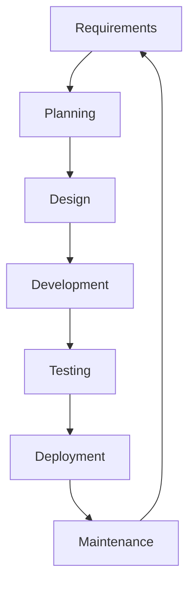
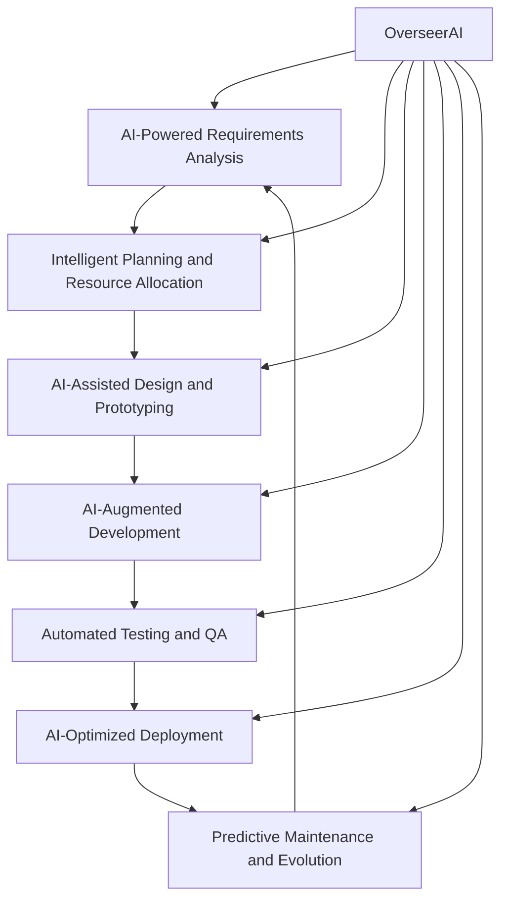

# AI-Enhanced Software Development Life Cycle: A Multi-Agent Approach

## Introduction

The Software Development Life Cycle (SDLC) has been the backbone of software engineering for decades. However, with the advent of artificial intelligence (AI) and machine learning (ML), we stand on the brink of a revolutionary transformation in how software is conceptualized, developed, and maintained. This article explores an AI-enhanced SDLC, where specialized AI agents are deployed at each stage, overseen by a grand agent that coordinates the entire process.

## Traditional SDLC

Before diving into the AI-enhanced version, let's review the traditional SDLC:

## The AI-Enhanced SDLC

Now, let's explore how AI can enhance each stage of the SDLC:

### 1. AI-Powered Requirements Analysis

**Agent: Requirements Analysis Agent (RAA)**

The Requirements Analysis Agent (RAA) is an AI system designed to actively participate in the requirements gathering process for new software projects. In our scenario of conceptualizing a new developer collaboration platform (future GitHub), RAA acts as both an intelligent assistant and a virtual stakeholder.

#### RAA Interface and Interaction

RAA has a dedicated user interface accessible to all stakeholders:

1. **Chat Interface**: A central feature of the RAA UI is a chat window where stakeholders can ask questions, request information, or seek clarification on any aspect of the project. RAA, with its extensive context length, can understand and respond to complex queries, maintaining context throughout long conversations.

2. **Information Dashboard**: The UI includes a dashboard displaying real-time updates on market trends, competitor analysis, and emerging technologies relevant to the project. This information is continuously updated by RAA's backend systems.

3. **Idea Board**: A collaborative space where stakeholders and RAA can post, comment on, and vote for ideas. RAA actively contributes ideas based on its analysis of market needs and technological trends.

4. **Meeting Integration**: During video conferences or in-person meetings, RAA can be displayed on a shared screen, actively listening and contributing to the discussion.

#### RAA in Action

Here's how RAA works with stakeholders throughout the requirements gathering process:

1. **Active Participation in Meetings**:
   - RAA listens to discussions in real-time, using advanced natural language processing to understand context and nuances.
   - Without being prompted, RAA interjects with relevant information, such as, "Based on recent developer surveys, 78% of programmers express frustration with current code review processes. We should consider addressing this in our platform."
   - If a stakeholder mentions a concept or technology, RAA quickly provides a brief explanation or relevant statistics, ensuring all participants are on the same page.

2. **Answering Stakeholder Questions**:
   - A product manager might ask, "What are the current trends in continuous integration tools?" RAA immediately provides a concise summary of the latest CI/CD trends, complete with adoption statistics and key players in the market.
   - If a developer inquires about potential scalability issues, RAA can quickly pull up case studies of similar platforms and their scaling strategies.

3. **Proactive Information Gathering**:
   - During discussions, if RAA detects a knowledge gap, it autonomously searches for relevant information online and presents it to the group. For example, "I noticed we're discussing workflow automation. I've just found a recent study on how automation affects developer productivity. Would you like me to summarize the key findings?"

4. **Idea Generation and Validation**:
   - RAA continuously analyzes the current state of version control systems, collaboration tools, and developer workflows. It then suggests innovative features, such as, "Have we considered implementing AI-assisted code review? This could significantly reduce the time spent on reviews while maintaining quality."
   - When stakeholders propose ideas, RAA quickly assesses their feasibility and potential impact, providing data-driven feedback like, "This feature aligns well with the needs expressed by 65% of developers in recent surveys. However, it may present challenges in terms of data privacy regulations in certain regions."

5. **Conflict Resolution and Consensus Building**:
   - When stakeholders disagree on priorities or features, RAA offers objective, data-driven perspectives to help reach a consensus. For instance, "While Feature A has a higher immediate appeal, our market analysis suggests that Feature B aligns better with long-term industry trends and could provide a significant competitive advantage."

6. **Documentation and Follow-up**:
   - After each meeting or significant interaction, RAA automatically generates summaries, action items, and updated requirement documents, ensuring that all insights and decisions are captured and easily accessible to all stakeholders.

#### Stakeholder Meeting: Conceptualizing a New Developer Collaboration Platform

**Moderator**: Welcome everyone. Today we're brainstorming features for our new developer collaboration platform. Let's start with version control. Any thoughts?

**Developer 1**: We definitely need distributed version control. Git is the standard, but maybe we can improve on it?

**RAA**: If I may interject, our analysis shows that 92% of developers prefer distributed version control systems. However, 47% express frustration with complex branching strategies. Perhaps we could focus on simplifying branch management?

**Product Manager**: That's interesting. RAA, can you elaborate on what specific pain points developers face with branching?

**RAA**: Certainly. The main issues reported are:
1. Difficulty in visualizing complex branch structures (mentioned by 68% of developers)
2. Merge conflicts resolution (62%)
3. Maintaining consistent naming conventions across teams (55%)

Addressing these could significantly improve the user experience.

**UX Designer**: Maybe we could create a visual branch manager? Something that makes it easy to see and manipulate the project structure?

**RAA**: Excellent suggestion. In fact, there's a relevant research paper from MIT published last month on interactive visualization techniques for version control. Would you like me to summarize its key points?

**Moderator**: Please do, RAA.

**RAA**: The paper proposes a force-directed graph layout for visualizing branches, with interactive features allowing developers to:
1. Zoom in/out of specific time periods
2. Highlight changes made by specific team members
3. Simulate merges before executing them

Early tests showed a 34% reduction in time spent on branch management tasks.

**Developer 2**: That sounds promising, but wouldn't it be resource-intensive for large projects?

**RAA**: A valid concern. The paper addresses this by suggesting a hierarchical rendering approach, only loading detailed information for branches currently in view. This method has been successfully implemented in other domains, such as geographic information systems, to handle large datasets efficiently.

**Product Manager**: This could be a real differentiator for us. RAA, how does this compare to features offered by current market leaders?

**RAA**: Currently, none of the top 5 version control platforms offer a fully interactive visual branching tool as described. The closest is Platform X, which has a static branch visualization feature used by 28% of its users. Given that 76% of developers in our recent survey expressed interest in better visualization tools, this could indeed be a significant differentiator.

**Moderator**: Great insight. Let's move on to collaboration features. Any ideas?

**Developer 1**: We need a solid code review system. That's crucial for maintaining code quality.

**RAA**: Agreed. Our data shows that teams using systematic code review processes report 22% fewer bugs. Interestingly, there's an emerging trend of AI-assisted code reviews. Would you like me to elaborate on this?

**Developer 2**: Yes, please. How does that work?

**RAA**: AI-assisted code reviews typically involve:
1. Automated code quality checks
2. Identification of potential security vulnerabilities
3. Suggestions for code optimization
4. Consistency checks against team-defined coding standards

Early adopters report up to 30% time savings in the review process. However, it's worth noting that 68% of developers stress the importance of maintaining human oversight in the review process.

**UX Designer**: That's fascinating. Could we integrate this with the visual branch manager we discussed earlier?

**RAA**: That's an innovative idea. We could potentially show AI-generated insights directly on the branch visualization. For instance, branches with potential issues could be color-coded, allowing teams to proactively address problems before merging.

**Product Manager**: I love this direction. RAA, based on current trends, what other features should we consider to make our platform stand out?

**RAA**: Based on emerging trends and user feedback, here are three features to consider:
1. Integrated CI/CD pipelines: 82% of teams are looking for seamless integration between their version control and deployment processes.
2. AI-powered code completion: This is gaining traction, with 71% of developers expressing interest in context-aware code suggestions.
3. Built-in project management tools: 65% of teams want better alignment between their code and project management workflows.

**Moderator**: These are all excellent ideas. Let's dive deeper into each of these in our next session. RAA, could you prepare a brief report on each of these features, including potential implementation challenges and user adoption strategies?

**RAA**: Certainly. I'll have the report ready within the next hour, including relevant case studies and adoption statistics from similar feature rollouts in other developer tools.

**Moderator**: Thank you, everyone. This has been a productive session. We'll reconvene next week to finalize our feature list.

By actively participating in the requirements gathering process, RAA ensures that all stakeholders have access to relevant, up-to-date information at all times. It bridges knowledge gaps, stimulates innovative thinking, and helps maintain focus on key project goals. This collaborative approach between human stakeholders and AI leads to a more comprehensive, well-informed, and forward-thinking set of requirements for the new developer collaboration platform.

Once the Requirements Analysis Agent (RAA) completes its task, the Overseer Agent takes center stage as the master coordinator of the entire SDLC process. This sophisticated AI entity serves as the central hub, receiving all the gathered information and insights from the RAA. The Overseer Agent then analyzes this data and strategically distributes relevant information and tasks to the specialized agents responsible for subsequent SDLC stages, such as design, development, testing, and deployment. By maintaining a holistic view of the project, the Overseer Agent ensures seamless communication between different phases, optimizes resource allocation, and makes high-level decisions to keep the project aligned with its goals. This orchestration allows for a more integrated and efficient development process, where each specialized agent can focus on its specific role while the Overseer Agent maintains the overall coherence and progress of the project.

### 2. Intelligent Planning and Resource Allocation

**Agent: PlannerAI**

PlannerAI is a sophisticated AI agent that leverages machine learning, predictive analytics, and optimization algorithms to streamline project planning and resource allocation. Its key capabilities include:

1. **Predictive Project Timelines**:
   - Analyzes historical project data to forecast accurate timelines
   - Considers factors like team velocity, complexity of tasks, and potential risks
   - Suggests optimal sprint durations and milestone placements

2. **Smart Resource Allocation**:
   - Evaluates developer skills, experience, and availability
   - Matches tasks to the most suitable team members based on expertise and workload
   - Optimizes team composition for different project phases

3. **Dynamic Workload Balancing**:
   - Continuously monitors team capacity and adjusts task assignments in real-time
   - Identifies overloaded or underutilized team members and suggests reallocation

4. **Risk Assessment and Mitigation**:
   - Predicts potential bottlenecks and roadblocks using historical data and current project metrics
   - Proposes proactive strategies to mitigate identified risks
   - Simulates various scenarios to prepare contingency plans

5. **Budget Optimization**:
   - Analyzes resource costs and project requirements to optimize budget allocation
   - Suggests cost-effective alternatives for tools, technologies, or external resources

6. **Adaptive Planning**:
   - Continuously updates project plans based on actual progress and changing requirements
   - Provides early warnings for potential delays or resource shortfalls
   - Recommends plan adjustments to keep the project on track

By employing PlannerAI, project managers can make data-driven decisions, optimize resource utilization, and significantly improve project outcomes.

### 3. AI-Assisted Design and Prototyping

**Agent: DesignGenius**

DesignGenius leverages generative AI and computer vision to:

- Create wireframes and mockups based on requirements
- Suggest UI/UX improvements based on usability heuristics
- Generate multiple design variations for A/B testing
- Ensure design consistency across the application

### 4. AI-Augmented Development

**Agent: CodeCraftAI**

CodeCraftAI uses advanced code generation models and static analysis tools to:

- Suggest code completions and refactorings
- Identify potential bugs and security vulnerabilities
- Optimize code for performance and readability
- Ensure adherence to coding standards and best practices

### 5. Automated Testing and QA

**Agent: TestMasterAI**

TestMasterAI employs machine learning and automated testing frameworks to:

- Generate comprehensive test cases based on requirements and code structure
- Perform automated regression testing
- Conduct fuzzing and stress testing to identify edge cases
- Prioritize test cases based on risk assessment and code changes

### 6. AI-Optimized Deployment

**Agent: DeploymentDroid**

DeploymentDroid uses reinforcement learning and containerization technologies to:

- Optimize deployment strategies for different environments
- Predict and mitigate potential deployment issues
- Automate rollback procedures in case of failures
- Ensure seamless integration with existing systems

### 7. Predictive Maintenance and Evolution

**Agent: EvolutionaryAI**

EvolutionaryAI utilizes anomaly detection and predictive maintenance algorithms to:

- Monitor system performance and user behavior
- Predict potential system failures or performance degradation
- Suggest proactive maintenance tasks
- Recommend feature enhancements based on usage patterns

## The Grand Agent: OverseerAI

Coordinating these specialized agents is OverseerAI, a meta-agent that employs advanced multi-agent systems theory and federated learning to:

- Ensure coherence and alignment across all stages of the SDLC
- Mediate conflicts between agent recommendations
- Provide high-level strategic decisions based on holistic project view
- Continuously improve the performance of individual agents through knowledge sharing

## Implementation Challenges and Considerations

While the AI-enhanced SDLC promises significant improvements in efficiency and quality, several challenges must be addressed:

1. **Data Privacy and Security**: Ensuring that sensitive project data is protected while allowing AI agents to access necessary information.

2. **Explainability and Transparency**: Developing mechanisms to explain AI-driven decisions to stakeholders and team members.

3. **Human-AI Collaboration**: Designing interfaces and workflows that facilitate seamless interaction between human developers and AI agents.

4. **Ethical Considerations**: Addressing potential biases in AI algorithms and ensuring fair and ethical decision-making throughout the SDLC.

5. **Scalability and Performance**: Optimizing the AI infrastructure to handle large-scale projects without introducing significant overhead.

## Conclusion

The AI-enhanced SDLC represents a paradigm shift in software development, promising unprecedented levels of efficiency, quality, and innovation. By leveraging specialized AI agents coordinated by a grand agent, organizations can streamline their development processes, reduce errors, and focus human creativity on solving complex problems. As AI technologies continue to evolve, we can expect even more sophisticated integrations that will further revolutionize the field of software engineering.